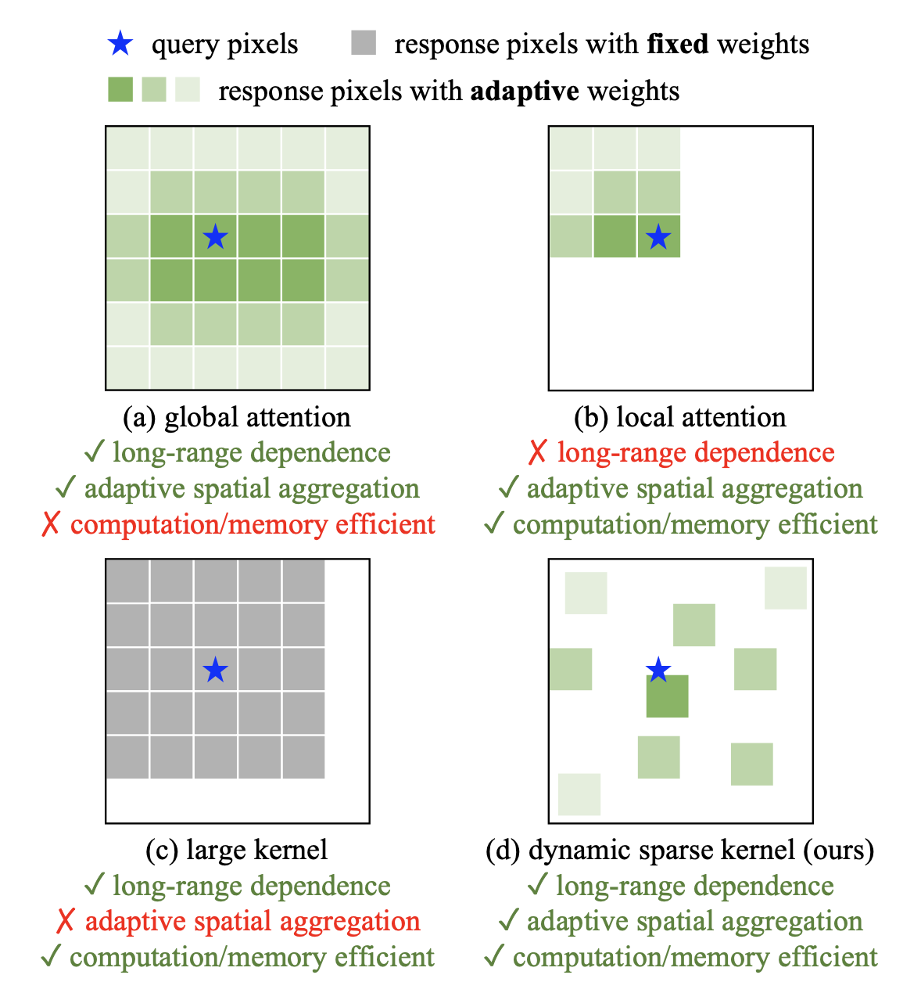

# InternImage: Exploring Large-Scale Vision Foundation Models with

## Ключевые особенности

* Сверточная сеть, основанная на деформируемых свертках (deformable convolutions);
* Позиционируется как большая фундаментальная модель для компьютерного зрения по аналогии с большими языковыми моделями (LLM);
* Backbone (каркас) InternImage может быть использован для задач классификации, детекции, сегментации и других задач, нужно только присоединить нужную "голову";
* Такие универсальные модели выкатывались и раньше, однако отличие данной модели в количестве параметров - более 1 млрд и 400 млн. обучающих примеров;
* Результаты сопоставимы с трансформерами. Очень хорошие результат в детекции на COCO датасете - 65 mAP;

## Мотивация

> ... CNNs are inferior to ViTs in the era of massive parameters and data, we argue that **CNN-based foundation models can also achieve comparable or even better performance than ViTs** when equipped with similar operator-/architecture-level designs, scaling-up parameters, and massive data.

* Большие сверточное сети, по мнению авторов, могут конкурировать с трансформерами если их оснастить:
  аналогичными архитектурными решениями, масштабируемыми параметрами и большим количеством данных.
* Основные сильные стороны трансформеров по сравнению со сверхточными сетями: 1 -  multi-head self attention или (MSHA, для краткости), обучаясь на больши данных, может выучить более сложные и устойчивые представления; 2 - трансформерная архитектура включает в себя такие продвинутые компоненты как Layer Normalization, feed-forward network, GELUGPA.
* Сложность в более широком использовани визуальных трансформеров - их чрезмерная ресурсоемкость (по вычислениям и памяти) механизма внимания, что становится особенно заметно на больших картах признаков (квадратичная зависимость от размера входного тензора).

## Архитектура

### Convolution vs. MHSA

Сравнение обычной свертки и MSHA:

* Связи/зависимости на больших расстояниях. Сверточным сетям сложно добиться большой зоны восприятия (receptive field, неплохой обзор [тут](https://theaisummer.com/receptive-field/)). Можно увеличивать размер фильтра, но это лишь частично решает проблему, при этом сильно увеличивая вычислительные затраты.
* Адаптивная пространственная агрегация (adaptive spatial aggregation). Имеется ввиду, что в MSHA веса динамически связаны с входным тензором, задаются им, тогда как в обычных свертках веса зафиксированы после обучения и меняются от изображения к изображению, подаваемым на вход. Это приводит к сильным inductive biases (даже пытаться не буду перевести, подробнее [тут](https://habr.com/ru/articles/591779/)). В свертках это предположение о компактности и нечувствительности к переносу.

> With the highly-inductive properties, models composed by regular
> convolutions might converge faster and require less training data than ViTs, but it also restricts CNNs from learning more general and robust patterns from web-scale data.

Свертки быстрее обучаются и требуют меньше данных по сравнению с трансформерами, однако на больших данных, перечисленные выше особенности становятся помехой в усвоении более общих и сложных закономерностей.

## Основной оператор InternImage

Основной оператор InternImage DCNv3 - это динамическая разреженная свертка с размером окна 3×3.

Смещения ячеек каждого сверточного фильтра являются переменными. Это позволяет настраивать область восприятия фильтра — чем более разреженный фильтр, тем большую площадь на карте признаков он захватывает.

Степень разреженности фильтра не только заложена в весах и обучается на данных (как было с предыдущими версиями деформируемых сверток), но она меняется в зависимости от конкретного входного изображения. Это похоже механизм внимания только в сверточное исполнении. Такая гибкость позволяет уменьшить чрезмерный inductive bias, присущий сверхточным сетям. Идея DCNv2 оператора взята от [сюда](https://openaccess.thecvf.com/content_CVPR_2019/papers/Zhu_Deformable_ConvNets_V2_More_Deformable_Better_Results_CVPR_2019_paper.pdf). В формуле ниже кружками выделены новые элементы, добавленные к обычной свертке.

> ...the sampling offset **∆pk** is flexible and able to interact with short or long-range features sampling offset **∆pk** and modulation scalar **mk** are learnable and conditioned by input x. So it can be found that DCNv2 shares similar favorable properties with MHSA, which motivated us to develop large-scale CNN-based foundation models on the basis of this operator.

1. 
4. Размер свертки 3x3 менее ресурсоемкий (число операций фильтра квадратично возрастает при увеличении размера) и хорошо оптимизированный (за счет широкого распространиения).** **
